# Database ERD — نظام اللحمدين لإدارة النفايات

> آخر تحديث: 2026-06-10
> المصدر: ملفات Models الفعلية في المشروع

---

## 1. المخطط البصري (Visual ERD Diagram)

---

## 2. نظرة عامة على الجداول

يتكون النظام من **22 جدولاً** موزعة على **8 تطبيقات**:

| التطبيق (App) | الجداول | الوصف |
|---|---|---|
| `accounts` | `User`, `DriverProfile`, `AgentProfile`, `EmployeeDocument` | المصادقة، بيانات السائقين والمندوبين، ومستندات الموظفين |
| `zones` | `Zone`, `Route` | المناطق الجغرافية ومسارات الجمع المخصصة |
| `subscribers` | `SubscriptionPlan`, `Subscriber`, `SubscriptionLog` | المشتركون (العملاء)، خطط الاشتراك، وسجل الاشتراكات التاريخي |
| `tracking` | `TruckLocation`, `CollectionVisit` | تتبع مواقع الشاحنات المباشر، وسجلات زيارات الجمع |
| `finance` | `Payment`, `CollectionSettlement`, `Expense`, `Advance`, `Penalty`, `StaffReward` | الدفعات، محاضر تسليم العُهدة، المصروفات، السلف، العقوبات والمكافآت |
| `complaints` | `Complaint`, `FieldReport`, `ServiceRating` | شكاوى العملاء، تقارير السائقين الميدانية، وتقييم الخدمة |
| `recycling` | `RecycleRequest`, `PointsTransaction`, `Reward` | طلبات إعادة التدوير، ونقاط المشتركين، والمكافآت الشهرية |
| `notifications` | `Notification` | الإشعارات الداخلية للمستخدمين |

---

## 3. مخطط الكود (Mermaid Diagram)

```mermaid
erDiagram
    User {
        bigint id PK
        string username UK "اسم المستخدم"
        string email UK "البريد الإلكتروني"
        string password "كلمة المرور"
        string role "الدور: admin|accountant|driver|agent|subscriber"
        bool is_active "نشط"
        bool is_staff "طاقم العمل"
        datetime date_joined "تاريخ الانضمام"
    }

    EmployeeProfile {
        bigint id PK
        bigint user_id UK "FK → User (OneToOne)"
        string first_name "الاسم الأول"
        string last_name "الاسم الأخير"
        string phone "الهاتف"
        bool is_active "فعّال"
    }

    DriverProfile {
        bigint id PK
        bigint employee_id UK "FK → EmployeeProfile (OneToOne)"
        bigint zone_id FK "FK → Zone"
        string license_number "رقم رخصة القيادة"
        string truck_number "رقم الشاحنة"
    }

    AgentProfile {
        bigint id PK
        bigint employee_id UK "FK → EmployeeProfile (OneToOne)"
        bigint zone_id FK "FK → Zone"
        decimal custody_amount "مبلغ العُهدة"
    }

    AccountantProfile {
        bigint id PK
        bigint employee_id UK "FK → EmployeeProfile (OneToOne)"
    }

    EmployeeDocument {
        bigint id PK
        bigint employee_id FK "FK → EmployeeProfile"
        string document_type "النوع"
        string title "العنوان"
        string file "الملف المرفوع"
        text notes "ملاحظات"
        date expires_at "تاريخ الانتهاء"
        datetime created_at "تاريخ الإنشاء"
    }

    Zone {
        bigint id PK
        string name UK "اسم المنطقة"
        string status "الحالة: active|inactive"
        json boundaries "حدود المنطقة (إحداثيات GPS)"
        datetime created_at "تاريخ الإنشاء"
        datetime updated_at "تاريخ التحديث"
    }

    Route {
        bigint id PK
        bigint zone_id FK "FK → Zone"
        bigint driver_id FK "FK → DriverProfile (السائق)"
        json collection_days "أيام الجمع الأسبوعية"
        json boundaries "حدود المسار (إحداثيات GPS)"
        string status "الحالة: active|frozen"
        datetime created_at "تاريخ الإنشاء"
    }

    SubscriptionPlan {
        bigint id PK
        string name "اسم الباقة"
        int duration_months "المدة بالأشهر"
        int bins_count "عدد السلات المخصصة"
        decimal price "السعر"
    }

    Subscriber {
        bigint id PK
        bigint user_id UK "FK → User (OneToOne)"
        bigint zone_id FK "FK → Zone"
        bigint route_id FK "FK → Route"
        bigint plan_id FK "FK → SubscriptionPlan"
        string subscription_id UK "رقم الاشتراك"
        string first_name "الاسم الأول"
        string last_name "الاسم الأخير"
        string phone "الهاتف"
        string color_status "التصنيف اللوني"
        float latitude "خط العرض"
        float longitude "خط الطول"
        string address "العنوان النصي"
        date subscription_start "تاريخ بداية الاشتراك"
        date subscription_end "تاريخ انتهاء الاشتراك"
        bool is_paused "موقوف مؤقتاً"
        date paused_at "تاريخ الإيقاف"
        text excuse "عذر التأخر عن السداد"
        datetime archived_at "تاريخ الأرشفة"
        datetime created_at "تاريخ التسجيل"
    }

    SubscriptionLog {
        bigint id PK
        bigint subscriber_id FK "FK → Subscriber"
        bigint plan_id FK "FK → SubscriptionPlan"
        bigint payment_id FK "FK → Payment"
        date start_date "تاريخ البداية"
        date end_date "تاريخ النهاية"
        datetime created_at "تاريخ التسجيل"
    }

    CollectionVisit {
        bigint id PK
        bigint route_id FK "FK → Route"
        bigint driver_id FK "FK → DriverProfile (السائق)"
        bigint subscriber_id FK "FK → Subscriber"
        date visit_date "تاريخ الزيارة"
        string status "الحالة: pending|collected|skipped|issue"
        text note "ملاحظات"
        datetime completed_at "وقت الإنجاز"
    }

    TruckLocation {
        bigint id PK
        bigint driver_id FK "FK → DriverProfile (السائق)"
        float latitude "خط العرض"
        float longitude "خط الطول"
        datetime timestamp "التوقيت"
    }

    Complaint {
        bigint id PK
        bigint subscriber_id FK "FK → Subscriber"
        string type "النوع"
        text description "الوصف"
        string status "الحالة: new|in_progress|resolved"
        string image "صورة مرفقة"
        datetime created_at "تاريخ الإنشاء"
        datetime resolved_at "تاريخ الحل"
    }

    FieldReport {
        bigint id PK
        bigint driver_id FK "FK → DriverProfile (السائق)"
        bigint subscriber_id FK "FK → Subscriber (اختياري)"
        string issue_type "نوع المشكلة"
        text note "ملاحظات"
        string image "صورة مرفقة"
        datetime created_at "تاريخ الإنشاء"
    }

    ServiceRating {
        bigint id PK
        bigint subscriber_id FK "FK → Subscriber"
        date month "الشهر"
        int rating "التقييم (1-5)"
        text comment "تعليق"
        datetime created_at "تاريخ الإنشاء"
    }

    CollectionSettlement {
        bigint id PK
        bigint agent_id FK "FK → AgentProfile"
        bigint accountant_id FK "FK → AccountantProfile"
        date date "تاريخ التسوية"
        decimal total_amount "المبلغ الإجمالي"
        string status "الحالة: pending|approved|rejected"
        text note "ملاحظات"
        datetime created_at "تاريخ الإنشاء"
    }

    Payment {
        bigint id PK
        bigint subscriber_id FK "FK → Subscriber"
        bigint plan_id FK "FK → SubscriptionPlan"
        bigint agent_id FK "FK → AgentProfile (المندوب)"
        bigint settlement_id FK "FK → CollectionSettlement"
        decimal amount "المبلغ"
        date date "التاريخ"
        string status "الحالة"
        string receipt_number UK "رقم الإيصال"
        datetime created_at "تاريخ التسجيل"
    }

    Expense {
        bigint id PK
        string description "الوصف"
        decimal amount "المبلغ"
        string category "التصنيف"
        date date "التاريخ"
    }

    Advance {
        bigint id PK
        bigint employee_id FK "FK → EmployeeProfile"
        decimal amount "المبلغ"
        string status "الحالة: active|paid"
        date date "التاريخ"
        text note "ملاحظة"
    }

    Penalty {
        bigint id PK
        bigint employee_id FK "FK → EmployeeProfile"
        string reason "السبب"
        decimal amount "المبلغ"
        date date "التاريخ"
    }

    StaffReward {
        bigint id PK
        bigint employee_id FK "FK → EmployeeProfile"
        string reason "السبب"
        decimal amount "المبلغ"
        date date "التاريخ"
    }

    RecycleRequest {
        bigint id PK
        bigint subscriber_id FK "FK → Subscriber"
        bigint confirmed_by_id FK "FK → DriverProfile (السائق المؤكد)"
        string category "الفئة"
        int bags_count "عدد الأكياس"
        string status "الحالة: pending|collected|cancelled"
        datetime created_at "تاريخ الإنشاء"
    }

    PointsTransaction {
        bigint id PK
        bigint subscriber_id FK "FK → Subscriber"
        bigint recycle_request_id UK "FK → RecycleRequest (OneToOne)"
        int points "النقاط"
        string reason "السبب"
        datetime created_at "تاريخ الإنشاء"
    }

    Reward {
        bigint id PK
        bigint subscriber_id FK "FK → Subscriber"
        string title "العنوان"
        date month "الشهر"
        datetime created_at "تاريخ الإنشاء"
    }

    Notification {
        bigint id PK
        bigint recipient_id FK "FK → User"
        string type "النوع"
        string title "العنوان"
        text body "المحتوى"
        bool is_read "مقروء"
        datetime created_at "تاريخ الإنشاء"
    }

    %% === العلاقات (Relationships) ===
    User ||--|| EmployeeProfile : "1:1"
    EmployeeProfile ||--|| DriverProfile : "1:1"
    EmployeeProfile ||--|| AgentProfile : "1:1"
    EmployeeProfile ||--|| AccountantProfile : "1:1"
    User ||--|| Subscriber : "1:1"
    
    EmployeeProfile ||--o{ EmployeeDocument : "1:N"
    EmployeeProfile ||--o{ Advance : "1:N"
    EmployeeProfile ||--o{ Penalty : "1:N"
    EmployeeProfile ||--o{ StaffReward : "1:N"
    
    User ||--o{ Notification : "1:N"
    User ||--o{ TruckLocation : "1:N"
    User ||--o{ FieldReport : "1:N"
    AgentProfile ||--o{ Payment : "1:N"
    AgentProfile ||--o{ CollectionSettlement : "1:N"
    AccountantProfile ||--o{ CollectionSettlement : "1:N"
    CollectionSettlement ||--o{ Payment : "1:N"
    User ||--o{ RecycleRequest : "1:N"
    User ||--o{ CollectionVisit : "1:N"

    Zone ||--o{ DriverProfile : "1:N"
    Zone ||--o{ AgentProfile : "1:N"
    Zone ||--o{ Route : "1:N"
    Zone ||--o{ Subscriber : "1:N"

    DriverProfile ||--o{ Route : "1:N"
    Route ||--o{ Subscriber : "1:N"

    Route ||--o{ CollectionVisit : "1:N"
    SubscriptionPlan ||--o{ Subscriber : "1:N"

    Subscriber ||--o{ CollectionVisit : "1:N"
    Subscriber ||--o{ Complaint : "1:N"
    Subscriber ||--o{ FieldReport : "1:N"
    Subscriber ||--o{ ServiceRating : "1:N"
    Subscriber ||--o{ Payment : "1:N"
    Subscriber ||--o{ RecycleRequest : "1:N"
    Subscriber ||--o{ PointsTransaction : "1:N"
    Subscriber ||--o{ Reward : "1:N"
    Subscriber ||--o{ SubscriptionLog : "1:N"
    Payment ||--o{ SubscriptionLog : "1:N"

    RecycleRequest ||--o| PointsTransaction : "1:1"
```

---

## 4. التفاصيل والعلاقات المدمجة

### 4.1 تطبيق الحسابات (Accounts)

#### `User` (جدول المستخدمين الأساسي)
يتضمن بيانات تسجيل الدخول فقط، بدون بيانات شخصية.
| الحقل | النوع | المفاتيح والعلاقات | الوصف |
|---|---|---|---|
| `id` | BigInt | 🔑 **مفتاح أساسي (PK)** | المعرف الفريد |
| `username` | CharField | 🔒 **فريد (UNIQUE)** | اسم المستخدم |
| `email` | EmailField | 🔒 **فريد (UNIQUE)** | البريد الإلكتروني |
| `password` | CharField | | كلمة المرور المشفرة |
| `role` | CharField | | الدور: `admin`, `accountant`, `driver`, `agent`, `subscriber` |
| `is_active` | Boolean | | حساب نشط أم لا |

#### `EmployeeProfile` (ملف الموظف الأساسي المشترك)
يحتوي على البيانات المشتركة بين كل الموظفين لتجنب التكرار.
| الحقل | النوع | المفاتيح والعلاقات | الوصف |
|---|---|---|---|
| `id` | BigInt | 🔑 **PK** | المعرف الفريد |
| `user_id` | BigInt | 🔗 **FK → User**   *(علاقة 1:1)* | يربط هذا الملف بالمستخدم. |
| `first_name` | CharField | | الاسم الأول |
| `last_name` | CharField | | الاسم الأخير |
| `phone` | CharField | | رقم الهاتف |
| `is_active` | Boolean | | الموظف نشط |

#### `DriverProfile` (ملف السائق)
| الحقل | النوع | المفاتيح والعلاقات | الوصف |
|---|---|---|---|
| `id` | BigInt | 🔑 **PK** | المعرف الفريد |
| `employee_id` | BigInt | 🔗 **FK → EmployeeProfile**   *(علاقة 1:1)* | يربط هذا الملف بملف الموظف الأساسي. |
| `zone_id` | BigInt | 🔗 **FK → Zone**   *(علاقة N:1)* | ينتمي السائق لمنطقة واحدة. |
| `license_number`| CharField | | رقم رخصة القيادة |
| `truck_number` | CharField | | رقم الشاحنة |

#### `AgentProfile` (ملف المندوب)
| الحقل | النوع | المفاتيح والعلاقات | الوصف |
|---|---|---|---|
| `id` | BigInt | 🔑 **PK** | المعرف الفريد |
| `employee_id` | BigInt | 🔗 **FK → EmployeeProfile**   *(علاقة 1:1)* | يربط هذا الملف بملف الموظف الأساسي. |
| `zone_id` | BigInt | 🔗 **FK → Zone**   *(علاقة N:1)* | منطقة عمل المندوب. |
| `custody_amount`| Decimal | | العهدة المالية النقدية |

#### `AccountantProfile` (ملف المحاسب)
| الحقل | النوع | المفاتيح والعلاقات | الوصف |
|---|---|---|---|
| `id` | BigInt | 🔑 **PK** | المعرف الفريد |
| `employee_id` | BigInt | 🔗 **FK → EmployeeProfile**   *(علاقة 1:1)* | يربط هذا الملف بملف الموظف الأساسي. |

#### `EmployeeDocument` (مستندات الموظفين)
| الحقل | النوع | المفاتيح والعلاقات | الوصف |
|---|---|---|---|
| `id` | BigInt | 🔑 **PK** | المعرف |
| `employee_id` | BigInt | 🔗 **FK → EmployeeProfile**   *(علاقة N:1)* | الموظف المالك للمستند. |
| `document_type` | CharField | | نوع المستند (هوية، رخصة، عقد) |
| `file` | FileField | | الملف المرفوع بالنظام |

---

### 4.2 تطبيق المناطق (Zones)

#### `Zone` (المناطق الجغرافية)
| الحقل | النوع | المفاتيح والعلاقات | الوصف |
|---|---|---|---|
| `id` | BigInt | 🔑 **PK** | المعرف |
| `name` | CharField | 🔒 **UNIQUE** | اسم المنطقة |
| `boundaries` | JSONField | | إحداثيات GPS تحدد حدود المنطقة |

#### `Route` (مسارات الجمع)
| الحقل | النوع | المفاتيح والعلاقات | الوصف |
|---|---|---|---|
| `id` | BigInt | 🔑 **PK** | المعرف |
| `zone_id` | BigInt | 🔗 **FK → Zone**   *(علاقة N:1)* | المسار يقع داخل منطقة محددة. (CASCADE) |
| `driver_id` | BigInt | 🔗 **FK → DriverProfile**   *(علاقة N:1)* | السائق المعين لهذا المسار. (SET_NULL) |
| `collection_days`| JSONField | | أيام الجمع الأسبوعية (مثل ["السبت", "الثلاثاء"]) |
| `boundaries` | JSONField | | إحداثيات حدود المسار على الخريطة لتوضيح نطاق التغطية الدقيق للمسار |

---

### 4.3 تطبيق المشتركين (Subscribers)

#### `SubscriptionPlan` (باقات الاشتراك)
| الحقل | النوع | المفاتيح والعلاقات | الوصف |
|---|---|---|---|
| `id` | BigInt | 🔑 **PK** | المعرف |
| `name` | CharField | | اسم الباقة (شهري، سنوي، ربع سنوي) |
| `duration_months` | Integer | | المدة بالأشهر |
| `bins_count` | Integer | | عدد السلات المخصصة (الافتراضي: 1) |
| `price` | Decimal | | السعر |

#### `Subscriber` (بيانات المشترك/العميل)
| الحقل | النوع | المفاتيح والعلاقات | الوصف |
|---|---|---|---|
| `id` | BigInt | 🔑 **PK** | المعرف |
| `user_id` | BigInt | 🔗 **FK → User**   *(علاقة 1:1)* | حساب تسجيل الدخول المرتبط بالمشترك. (CASCADE) |
| `zone_id` | BigInt | 🔗 **FK → Zone**   *(علاقة N:1)* | منطقة المشترك الجغرافية. |
| `route_id`| BigInt | 🔗 **FK → Route**   *(علاقة N:1)* | مسار الجمع التابع له المشترك. |
| `plan_id` | BigInt | 🔗 **FK → SubscriptionPlan**   *(علاقة N:1)* | باقة الاشتراك الحالية للعميل. |
| `subscription_id`| CharField | 🔒 **UNIQUE** | رقم المشترك المميز المولد آلياً (مثل SUB-0001) |
| `color_status` | CharField | | لون الحالة (أخضر/أصفر/أحمر) يُحسب برمجياً بناءً على تاريخ الانتهاء. يُحدَث تلقائياً عند التسجيل (المشترك الجديد يبدأ أحمر) وعند الدفع |
| `latitude` | Float | | خط العرض لموقع منزل المشترك |
| `longitude` | Float | | خط الطول لموقع منزل المشترك |
| `subscription_end`| DateField | | تاريخ انتهاء الاشتراك الفعلي |
| `is_paused` | Boolean | | حالة إيقاف الخدمة مؤقتاً |
| `archived_at` | DateTime | | تاريخ الأرشفة (النظام يستخدم الحذف الناعم Soft Delete) |

#### `SubscriptionLog` (سجل الاشتراكات التاريخي)
| الحقل | النوع | المفاتيح والعلاقات | الوصف |
|---|---|---|---|
| `id` | BigInt | 🔑 **PK** | المعرف |
| `subscriber_id` | BigInt | 🔗 **FK → Subscriber**   *(علاقة N:1)* | المشترك صاحب السجل |
| `plan_id` | BigInt | 🔗 **FK → SubscriptionPlan**   *(علاقة N:1)* | الباقة التي تم الاشتراك بها في هذه الفترة |
| `payment_id` | BigInt | 🔗 **FK → Payment**   *(علاقة N:1)* | الفاتورة أو الدفعة التي تم تفعيل هذا الاشتراك بناءً عليها |
| `start_date` | DateField | | تاريخ بداية الفترة |
| `end_date` | DateField | | تاريخ نهاية الفترة |

---

### 4.4 تطبيق التتبع (Tracking)

#### `TruckLocation` (مواقع الشاحنات المباشر)
| الحقل | النوع | المفاتيح والعلاقات | الوصف |
|---|---|---|---|
| `id` | BigInt | 🔑 **PK** | المعرف |
| `driver_id` | BigInt | 🔗 **FK → DriverProfile**   *(علاقة N:1)* | السائق الذي يُرسل الإحداثيات حالياً من التطبيق. |
| `latitude` | Float | | خط العرض الحالي |
| `longitude` | Float | | خط الطول الحالي |

#### `CollectionVisit` (زيارات الجمع للمشتركين)
| الحقل | النوع | المفاتيح والعلاقات | الوصف |
|---|---|---|---|
| `id` | BigInt | 🔑 **PK** | المعرف |
| `route_id` | BigInt | 🔗 **FK → Route**   *(علاقة N:1)* | المسار الذي تنتمي له الزيارة. |
| `driver_id` | BigInt | 🔗 **FK → DriverProfile**   *(علاقة N:1)* | السائق المنفذ للزيارة. |
| `subscriber_id` | BigInt | 🔗 **FK → Subscriber**   *(علاقة N:1)* | المشترك المستهدف بالزيارة. |
| `visit_date` | DateField | 🔒 **UNIQUE_TOGETHER** | تاريخ الزيارة (يُمنع تكرار الزيارة لنفس المشترك في نفس المسار بنفس اليوم) |
| `status` | CharField | | حالة الزيارة: تمت / واجهت مشكلة / تم تخطيها |

---

### 4.5 تطبيق المالية (Finance)

#### `CollectionSettlement` (تسوية الجباية اليومية)
| الحقل | النوع | المفاتيح والعلاقات | الوصف |
|---|---|---|---|
| `id` | BigInt | 🔑 **PK** | المعرف |
| `agent_id` | BigInt | 🔗 **FK → AgentProfile**   *(علاقة N:1)* | المندوب مُسلم العهدة |
| `accountant_id` | BigInt | 🔗 **FK → AccountantProfile**   *(علاقة N:1)* | المحاسب مُستلم العهدة |
| `date` | DateField | | تاريخ التسوية |
| `total_amount` | Decimal | | إجمالي المبلغ المورد |
| `status` | CharField | | حالة التسوية (معلقة، معتمدة، مرفوضة) |
| `note` | TextField | | ملاحظات |

#### `Payment` (المدفوعات)
| الحقل | النوع | المفاتيح والعلاقات | الوصف |
|---|---|---|---|
| `id` | BigInt | 🔑 **PK** | المعرف |
| `subscriber_id` | BigInt | 🔗 **FK → Subscriber**   *(علاقة N:1)* | المشترك الدافع للاشتراك. |
| `plan_id` | BigInt | 🔗 **FK → SubscriptionPlan**   *(علاقة N:1)* | باقة الاشتراك التي تم دفعها. |
| `agent_id` | BigInt | 🔗 **FK → AgentProfile**   *(علاقة N:1)* | المندوب المستلم للمبلغ (اختياري). |
| `settlement_id` | BigInt | 🔗 **FK → CollectionSettlement**   *(علاقة N:1)* | محضر تسليم العهدة المرتبط بهذه الدفعة (اختياري). |
| `amount` | Decimal | | المبلغ |
| `receipt_number` | CharField | 🔒 **UNIQUE** | رقم الإيصال الآلي (مثل REC-123456) |

#### جداول (Expense, Advance, Penalty, StaffReward)
ترتبط السلف والمكافآت والغرامات بـ `employee_id` بعلاقة **(N:1)** مع جدول `EmployeeProfile`.
- الموظف يمكن أن يكون له عدة سلف (`Advance`)، عقوبات (`Penalty`)، ومكافآت (`StaffReward`). وهذا يمنع منعاً باتاً تسجيل سلفة على مشترك، حيث أن المشترك لا يمتلك `EmployeeProfile`.
- جدول `Expense` لتسجيل مصاريف الشركة (وقود، صيانة، رواتب).

---

### 4.6 تطبيق الشكاوى (Complaints)

#### `Complaint` (شكاوى العملاء)
| الحقل | النوع | المفاتيح والعلاقات | الوصف |
|---|---|---|---|
| `id` | BigInt | 🔑 **PK** | المعرف |
| `subscriber_id` | BigInt | 🔗 **FK → Subscriber**   *(علاقة N:1)* | العميل المشتكي. (العميل له عدة شكاوى) |
| `type` | CharField | | نوع الشكوى (تأخير / تلف حاوية / الخ) |
| `status` | CharField | | الحالة (جديدة / جاري الحل / محلولة) |

#### `FieldReport` (بلاغات السائقين الميدانية)
| الحقل | النوع | المفاتيح والعلاقات | الوصف |
|---|---|---|---|
| `id` | BigInt | 🔑 **PK** | المعرف |
| `driver_id` | BigInt | 🔗 **FK → DriverProfile**   *(علاقة N:1)* | السائق المُبلّغ عن المشكلة. |
| `subscriber_id` | BigInt | 🔗 **FK → Subscriber**   *(علاقة N:1)* | المشترك المعني بالبلاغ (اختياري). |
| `issue_type` | CharField | | نوع المشكلة (حاوية ممتلئة جداً / تالفة) |

#### `ServiceRating` (تقييم الخدمة)
| الحقل | النوع | المفاتيح والعلاقات | الوصف |
|---|---|---|---|
| `id` | BigInt | 🔑 **PK** | المعرف |
| `subscriber_id` | BigInt | 🔗 **FK → Subscriber**   *(علاقة N:1)* | المشترك المقيِّم. |
| `month` | DateField | 🔒 **UNIQUE_TOGETHER** | الشهر المقيَّم (مسموح بتقييم واحد فقط لكل مشترك شهرياً). |

---

### 4.7 تطبيق إعادة التدوير (Recycling)

#### `RecycleRequest` (طلبات أخذ مواد التدوير)
| الحقل | النوع | المفاتيح والعلاقات | الوصف |
|---|---|---|---|
| `id` | BigInt | 🔑 **PK** | المعرف |
| `subscriber_id` | BigInt | 🔗 **FK → Subscriber**   *(علاقة N:1)* | المشترك صاحب الطلب. |
| `confirmed_by_id`| BigInt | 🔗 **FK → DriverProfile**   *(علاقة N:1)* | السائق الذي جمع المواد المعزولة. |

#### `PointsTransaction` (سجل نقاط التدوير)
| الحقل | النوع | المفاتيح والعلاقات | الوصف |
|---|---|---|---|
| `id` | BigInt | 🔑 **PK** | المعرف |
| `subscriber_id` | BigInt | 🔗 **FK → Subscriber**   *(علاقة N:1)* | المشترك الحاصل على النقاط. |
| `recycle_request_id`| BigInt| 🔗 **FK → RecycleRequest**   *(علاقة 1:1)* | الطلب المرتبط بالنقاط. (UNIQUE لمنع تكرار النقاط لنفس الطلب) |

---

### 4.8 تطبيق الإشعارات (Notifications)

#### `Notification` (الإشعارات الداخلية)
| الحقل | النوع | المفاتيح والعلاقات | الوصف |
|---|---|---|---|
| `id` | BigInt | 🔑 **PK** | المعرف |
| `recipient_id` | BigInt | 🔗 **FK → User**   *(علاقة N:1)* | المستخدم المستلم للإشعار. |
| `type` | CharField | | نوع الإشعار تصنيفياً (نظام، شكوى، تتبع) |
| `is_read` | Boolean | | مقروء أو غير مقروء |
