# Use Cases — حالات الاستخدام

> آخر تحديث: 2026-06-10
> المصدر: المتطلبات الوظيفية + Django Models + API Endpoints الفعلية

---

## مخطط حالات الاستخدام (Use Case Diagram)

```mermaid
flowchart LR
    Admin([🔑 مدير])
    Accountant([💰 محاسب])
    Driver([🚛 سائق])
    Agent([📋 مندوب])
    SubscriberActor([🏠 مشترك])

    UC_Zones((إدارة المناطق والمسارات))
    UC_Staff((إدارة الموظفين والوثائق))
    UC_Register((تسجيل مشترك))
    UC_SubManage((إدارة المشتركين))
    UC_Daily((قائمة الجمع اليومية))
    UC_Visit((تأكيد جمع منزل))
    UC_Collect((تحصيل اشتراك))
    UC_Deposit((مطابقة العُهد والتوريد))
    UC_Expenses((تسجيل المصروفات))
    UC_HR((الجزاءات والمكافآت والسلف))
    UC_Complaint((الشكاوى))
    UC_FieldReport((البلاغات الميدانية))
    UC_Rating((تقييم الخدمة))
    UC_Recycle((التدوير والنقاط))
    UC_Draw((السحب البيئي))
    UC_Tracking((تتبع الشاحنة))
    UC_Reports((التقارير والتصدير))
    UC_Notifications((الإشعارات))
    UC_Login((تسجيل الدخول))
    UC_Pause((إيقاف/استئناف الاشتراك))

    Admin --> UC_Zones
    Admin --> UC_Staff
    Admin --> UC_Draw
    Admin --> UC_Reports
    Admin --> UC_Complaint
    Admin --> UC_SubManage
    Admin --> UC_HR
    Admin --> UC_Login

    Accountant --> UC_Collect
    Accountant --> UC_Deposit
    Accountant --> UC_Expenses
    Accountant --> UC_HR
    Accountant --> UC_Reports
    Accountant --> UC_Login

    Driver --> UC_Daily
    Driver --> UC_Visit
    Driver --> UC_Recycle
    Driver --> UC_Tracking
    Driver --> UC_FieldReport
    Driver --> UC_Login

    Agent --> UC_Register
    Agent --> UC_Collect
    Agent --> UC_SubManage
    Agent --> UC_Deposit
    Agent --> UC_Login

    SubscriberActor --> UC_Register
    SubscriberActor --> UC_Complaint
    SubscriberActor --> UC_Rating
    SubscriberActor --> UC_Recycle
    SubscriberActor --> UC_Tracking
    SubscriberActor --> UC_Notifications
    SubscriberActor --> UC_Pause
    SubscriberActor --> UC_Login
```

---

## السيناريوهات الرئيسية (Main Scenarios)

### 1. تسجيل الدخول (Login)
| الخطوة | الوصف | الجدول/الـ API |
|---|---|---|
| 1 | المستخدم يدخل اسم المستخدم وكلمة المرور | `POST /api/auth/login/` |
| 2 | النظام يتحقق من البيانات ويُصدر JWT Token | `User` → `access + refresh` |
| 3 | النظام يوجه المستخدم للواجهة المناسبة حسب دوره (RBAC) | `User.role` |
| 4 | التطبيق يخزن الـ Token ويرسله مع كل طلب | `Authorization: Bearer <token>` |

### 2. تسجيل مشترك جديد
| الخطوة | الوصف | الجدول/الـ API |
|---|---|---|
| 1 | المشترك يسجل ذاتياً من التطبيق، أو المندوب يسجله ميدانياً | `POST /api/users/register/` أو `POST /api/subscribers/` |
| 2 | النظام ينشئ `User` بدور `subscriber` | `User(role='subscriber')` |
| 3 | المندوب يختار الباقة من قائمة ديناميكية يجلبها التطبيق من `/plans/` | `SubscriptionPlan` |
| 4 | النظام ينشئ `Subscriber` ويحفظ الاسم والهاتف والموقع GPS والباقة | `Subscriber` |
| 5 | إذا وصلت إحداثيات GPS، يتحقق النظام من التغطية بـ Point-in-Polygon | `Zone.boundaries` |
| 6 | إذا لم يُلتقط الموقع، يُربط المشترك تلقائياً بمنطقة المندوب (`profile_zone`) | `AgentProfile.zone` |
| 7 | النظام يولد `subscription_id` فريد تلقائياً (SUB-XXXX) | `Subscriber.subscription_id` UNIQUE |
| 8 | النظام يستدعي `update_color_status()` فيصبح المشترك **أحمر (مستحق الدفع)** حتى يسدد | `Subscriber.color_status = 'red'` |

### 3. قائمة الجمع اليومية
| الخطوة | الوصف | الجدول/الـ API |
|---|---|---|
| 1 | السائق يفتح شاشة اليوم في التطبيق | `GET /api/subscribers/daily_list/` |
| 2 | النظام يبحث عن `Route` النشطة للسائق واليوم الحالي | `Route.collection_days`, `Route.status=active` |
| 3 | النظام ينشئ أو يعيد `CollectionVisit` لكل مشترك نشط في منطقة المسار | `CollectionVisit(status='pending')` |
| 4 | السائق يغير حالة كل منزل | `POST /api/collection-visits/{id}/mark_status/` |
| 5 | الحالات المتاحة: `collected` (تم الجمع)، `skipped` (تم التخطي)، `issue` (مشكلة) | `CollectionVisit.status` |

### 4. تحصيل مبلغ الاشتراك
| الخطوة | الوصف | الجدول/الـ API |
|---|---|---|
| 1 | المندوب يدخل بيانات المشترك والمبلغ | `POST /api/payments/` |
| 2 | النظام يتأكد أن المشترك داخل منطقة المندوب | `AgentProfile.zone == Subscriber.zone` |
| 3 | النظام ينشئ `Payment` بحالة `pending` | `Payment(status='pending')` |
| 4 | النظام يولد رقم إيصال فريد (REC-XXXXXX) | `Payment.receipt_number` UNIQUE |
| 5 | النظام يرسل إشعار داخلي للمشترك | `Notification` |
| 6 | النظام يحدث حالة المشترك اللونية تلقائياً | `Subscriber.update_color_status()` |
| 7 | المحاسب يحول الدفع لاحقاً إلى `deposited` عند التوريد | `POST /api/finance/payments/{id}/mark_deposited/` |

### 4.1 تسليم العُهدة النقدية (جديد)
| الخطوة | الوصف | الجدول/الـ API |
|---|---|---|
| 1 | المندوب يرى بنر تنبيهي في صفحة التحصيل بالمبالغ المعلقة | صفحة `collect.jsx` |
| 2 | المندوب ينقر "تسليم للمحاسب" | `POST /api/finance/settlements/` |
| 3 | النظام ينشئ `CollectionSettlement` بحالة `pending` ويربط الفواتير المعلقة بالمحضر | `CollectionSettlement`, `Payment.settlement` |
| 4 | المحاسب يعتمد المحضر | `POST /api/finance/settlements/{id}/approve/` |
| 5 | حالة الفواتير تتحول إلى `deposited` | `Payment.status = 'deposited'` |

### 5. إدارة الشكاوى والبلاغات
| الخطوة | الوصف | الجدول/الـ API |
|---|---|---|
| 1 | المشترك يرسل شكوى من التطبيق (نصية أو مصوّرة) | `POST /api/complaints/` |
| 2 | النظام يربط الشكوى تلقائياً بالمشترك ويحدد النوع | `Complaint(type='late|damaged|missing|other')` |
| 3 | الحالة الأولية: `new` (جديدة) | `Complaint.status = 'new'` |
| 4 | الإدارة تتابع وتحدث الحالة من الداشبورد | `PUT /api/complaints/{id}/` |
| 5 | الحالات: `new` → `in_progress` → `resolved` | `Complaint.status`, `Complaint.resolved_at` |
| — | **البلاغ الميداني (من السائق):** | |
| 6 | السائق يرسل بلاغ عن حالة السلة (ممتلئة/تالفة/مفقودة/فارغة) + صورة | `POST /api/field-reports/` |
| 7 | النظام ينشئ إشعار داخلي للإدارة تلقائياً | `Notification` |

### 6. دورة إعادة التدوير
| الخطوة | الوصف | الجدول/الـ API |
|---|---|---|
| 1 | المشترك يطلب جمع أكياس مفروزة (بلاستيك/معادن/ورق/خبز) | `POST /api/recycling/` |
| 2 | السائق يرى الطلبات المعلقة داخل منطقته | `GET /api/recycling/` (scoped by zone) |
| 3 | السائق يؤكد استلام الأكياس | `POST /api/recycling/{id}/confirm/` |
| 4 | النظام ينشئ `PointsTransaction` مرة واحدة فقط لكل طلب (Idempotent) | `PointsTransaction(recycle_request=OneToOne)` |
| 5 | لوحة المتصدرين تعرض ترتيب المشتركين حسب النقاط | `GET /api/points/leaderboard/` |

### 7. السحب البيئي الشهري
| الخطوة | الوصف | الجدول/الـ API |
|---|---|---|
| 1 | المدير يشغل السحب البيئي من لوحة التحكم | `POST /api/rewards/draw/` |
| 2 | النظام يختار مشتركاً مؤهلاً عشوائياً (له عمليات تدوير مؤكدة) | `RecycleRequest.status='collected'` |
| 3 | النظام ينشئ `Reward` للفائز | `Reward` |
| 4 | النظام يمدد اشتراك الفائز 30 يوماً | `Subscriber.subscription_end += 30` |
| 5 | النظام يسجل مصروف `marketing` تلقائياً | `Expense(category='marketing')` |
| 6 | النظام يرسل إشعار داخلي للفائز | `Notification` |

### 8. التقارير والتصدير
| الخطوة | الوصف | الجدول/الـ API |
|---|---|---|
| 1 | المدير أو المحاسب يفتح شاشة التقارير | Dashboard Reports |
| 2 | النظام يعرض 4 أنواع تقارير: KPIs، مالية، تشغيلية، نمو | `/api/reports/dashboard|financial|operational|growth/` |
| 3 | البيانات المالية: إيرادات من `Payment`، مصروفات من `Expense`، ديون من `Subscriber` | حسابات حقيقية من DB |
| 4 | البيانات التشغيلية: زيارات من `CollectionVisit`، شكاوى من `Complaint`، بلاغات من `FieldReport` | حسابات حقيقية من DB |
| 5 | المستخدم يصدر التقرير بصيغة PDF أو XLSX | `GET /api/reports/export/?format=pdf|xlsx` |

### 9. إيقاف واستئناف الاشتراك
| الخطوة | الوصف | الجدول/الـ API |
|---|---|---|
| 1 | المشترك يطلب إيقاف مؤقت (للسفر مثلاً) | `POST /api/subscribers/{id}/pause/` |
| 2 | النظام يسجل `is_paused=True`، `paused_at`، و `pause_reason` | `Subscriber` |
| 3 | المشترك يستأنف الاشتراك | `POST /api/subscribers/{id}/resume/` |
| 4 | النظام يحسب أيام الإيقاف ويمدد `subscription_end` تلقائياً | `subscription_end += paused_days` |

### 10. إدارة الموارد البشرية (HR)
| الخطوة | الوصف | الجدول/الـ API |
|---|---|---|
| 1 | المدير يضيف موظف جديد (سائق/مندوب/محاسب) | `POST /api/users/` → Dashboard Staff |
| 2 | النظام ينشئ `User` + البروفايل المناسب (`DriverProfile`/`AgentProfile`) | Profile حسب `User.role` |
| 3 | المدير يرفع وثائق الموظف (هوية، رخصة) | `POST /api/employee-documents/` |
| 4 | المحاسب يسجل سلفة للموظف | `POST /api/finance/advances/` → `Advance(status='active')` |
| 5 | المحاسب يسجل جزاء أو مكافأة | `POST /api/finance/penalties/` أو `/api/finance/staff-rewards/` |
| 6 | المحاسب يغلق السلفة عند السداد | `POST /api/finance/advances/{id}/mark_paid/` |

---

## مصفوفة الأدوار × حالات الاستخدام

| حالة الاستخدام | مدير | محاسب | سائق | مندوب | مشترك |
|---|---|---|---|---|---|
| تسجيل الدخول | ✅ | ✅ | ✅ | ✅ | ✅ |
| إدارة المناطق والمسارات | ✅ | ❌ | ❌ | ❌ | ❌ |
| إدارة الموظفين والوثائق | ✅ | ❌ | ❌ | ❌ | ❌ |
| تسجيل مشترك | ✅ | ❌ | ❌ | ✅ | ✅ (ذاتي) |
| إدارة المشتركين | ✅ | ❌ | ❌ | ✅ (منطقته) | ❌ |
| قائمة الجمع اليومية | ❌ | ❌ | ✅ | ❌ | ❌ |
| تأكيد جمع منزل | ❌ | ❌ | ✅ | ❌ | ❌ |
| تحصيل اشتراك | ✅ | ✅ | ❌ | ✅ | ❌ |
| مطابقة العُهد والتوريد | ✅ | ✅ | ❌ | ❌ | ❌ |
| **تسليم العُهدة النقدية** | ❌ | ✅ (اعتماد) | ❌ | **✅ (تسليم)** | ❌ |
| المصروفات | ✅ | ✅ | ❌ | ❌ | ❌ |
| الجزاءات والمكافآت والسلف | ✅ | ✅ | ❌ | ❌ | ❌ |
| تقديم شكوى | ✅ (عرض) | ❌ | ❌ | ❌ | ✅ |
| بلاغ ميداني | ✅ (عرض) | ❌ | ✅ | ❌ | ❌ |
| تقييم الخدمة | ❌ | ❌ | ❌ | ❌ | ✅ |
| طلب تدوير | ❌ | ❌ | ✅ (تأكيد) | ❌ | ✅ (طلب) |
| السحب البيئي | ✅ | ❌ | ❌ | ❌ | ❌ |
| تتبع الشاحنة | ✅ (لوحة تحكم) | ❌ | ✅ (إرسال موقع) | ❌ | ✅ (مشاهدة) |
| التقارير والتصدير | ✅ | ✅ (مالية فقط) | ❌ | ❌ | ❌ |
| الإشعارات | ✅ | ✅ | ✅ | ✅ | ✅ |
| إيقاف/استئناف الاشتراك | ✅ | ❌ | ❌ | ❌ | ✅ |
